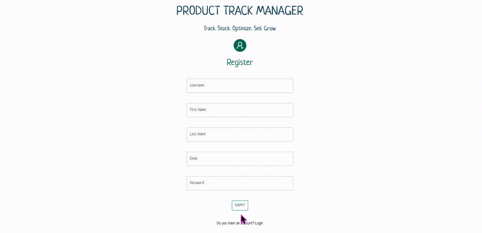

# 📈 Product Track Manager
## Track Your Stock, Boost Your Growth!

Product Track Manager is a modern web application for managing product data, sales, purchases, and more. Built with React, Vite, Tailwind CSS, Redux, and Axios, this app provides a seamless user experience for tracking and managing products efficiently. It's designed to be fast, responsive, and user-friendly, making it easy for users to access important product data in one place.

👉 **Live Demo:** [https://product-track-manager-app.netlify.app/]

### Demo




### Features

- 📦 **Product Management**: Effortlessly manage products, view details, and make edits.

- 📊 **Sales & Purchases Tracking**: Track sales and purchases to monitor inventory and sales performance.

- 🔐 **Authentication**: Secure login and registration using Firebase Authentication.

- 🌐 **API Integration**: Fetch product data and manage transactions with Axios.

- 🖥️ **Multiple API Requests**: Use `Promise.all()` to handle multiple requests efficiently.

- 🔔 **Toast Notifications**: Real-time notifications for user actions with React-Toastify.

- 🌙 **Light/Dark Mode**: Switch between light and dark themes for an optimal experience.


### Tech Stack

**React** (with Vite) - Fast, modern frontend framework.

**Redux & Redux Toolkit** - State management for handling product and user data.

**Axios** - For making API requests and handling data fetching.

**React Router Dom** - For routing and page navigation.

**React-Toastify** - To display smooth and informative notifications.

**Tailwind CSS** - Utility-first CSS framework for styling.

**Vite** - Build tool for fast, optimized development.

**PNPM** - Efficient package manager for faster dependency management.

### Project Structure
```plaintext
📦src
 ┣ 📂app
 ┃ ┗ 📜store.jsx
 ┣ 📂components
 ┃ ┣ 📂Cards
 ┃ ┃ ┣ 📜BrandsCard.jsx
 ┃ ┃ ┣ 📜FirmsCard.jsx
 ┃ ┃ ┗ 📜KCard.jsx
 ┃ ┣ 📂Modal
 ┃ ┃ ┣ 📜BrandModal.jsx
 ┃ ┃ ┣ 📜FirmModal.jsx
 ┃ ┃ ┣ 📜ProductModal.jsx
 ┃ ┃ ┣ 📜PurchasesModal.jsx
 ┃ ┃ ┗ 📜SalesModal.jsx
 ┃ ┣ 📂TableAndChart
 ┃ ┃ ┣ 📜Charts.jsx
 ┃ ┃ ┣ 📜ProductsTable.jsx
 ┃ ┃ ┣ 📜PurchasesTable.jsx
 ┃ ┃ ┗ 📜SalesTable.jsx
 ┃ ┣ 📜AuthHeader.jsx
 ┃ ┣ 📜ErrorBoundary.jsx
 ┃ ┣ 📜LoginForm.jsx
 ┃ ┣ 📜MenuListItems.jsx
 ┃ ┗ 📜RegisterForm.jsx
 ┣ 📂features
 ┃ ┣ 📜authSlice.jsx
 ┃ ┗ 📜stockSlice.jsx
 ┣ 📂helper
 ┃ ┗ 📜ToastNotify.js
 ┣ 📂hook
 ┃ ┣ 📜useAuthCall.jsx
 ┃ ┣ 📜useAxios.jsx
 ┃ ┗ 📜useStockCall.jsx
 ┣ 📂pages
 ┃ ┣ 📜Brands.jsx
 ┃ ┣ 📜Dashboard.jsx
 ┃ ┣ 📜Firms.jsx
 ┃ ┣ 📜Home.jsx
 ┃ ┣ 📜Login.jsx
 ┃ ┣ 📜Products.jsx
 ┃ ┣ 📜Purchases.jsx
 ┃ ┣ 📜Register.jsx
 ┃ ┗ 📜Sales.jsx
 ┣ 📂registerCall
 ┃ ┗ 📜registerCall.jsx
 ┣ 📂router
 ┃ ┣ 📜AppRouter.jsx
 ┃ ┗ 📜PrivateRouter.jsx
 ┣ 📂styles
 ┃ ┣ 📜buttonStyles.js
 ┃ ┗ 📜theme.js
 ┣ 📜App.jsx
 ┣ 📜_redirects
 ┗ 📜main.jsx
```
### Installation & Setup 

1. **Clone the Repository:**
   ```bash 
    git clone https://github.com/zbaharyilmaz/product-track-manager.git

    cd product-track-manager

2. **Install Dependencies:**

   ```bash
    pnpm install
3. **Run the Development Server:**

   ```bash
    pnpm dev
5. **Open the App:**

- Visit http://localhost:3000 in your browser to view the app.

###  Contributing

Feel free to fork the repo and submit PRs for improvements!

